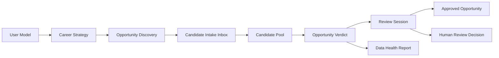

# Architecture Overview

## System Shape

## Data Boundary

- Private runtime data stays in the local app.
- Public mirror data is simulated and sanitized.
- Exported JSON is private by default.
- Demo artifacts are fictional and explicitly marked simulated.

## Review Boundary

AI can draft:

- profile summaries
- strategy options
- opportunity verdicts
- review sessions
- next-step suggestions

Human must confirm:

- applying profile or context
- applying strategy
- advancing, rejecting, or archiving opportunities
- creating Approved Opportunity records
- sending messages or using external channels

## Public / Private Separation

The private project contains source code and local workflow docs. This mirror contains only review-safe docs, schemas, evals, and fictional demos. It intentionally excludes production state and personal career data.

## Validation Loop

1. Parse JSON schemas.
2. Parse demo JSON.
3. Run eval checker.
4. Scan for private paths and secrets.
5. Verify README positioning.
6. Verify demo sanitation and no external side effects.
