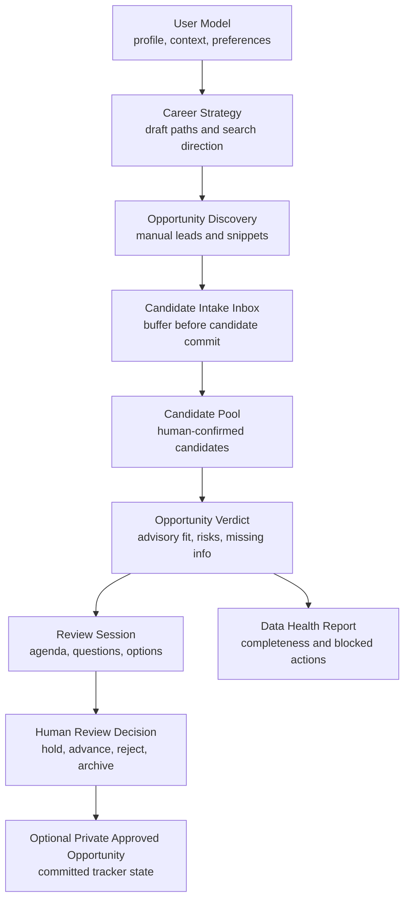
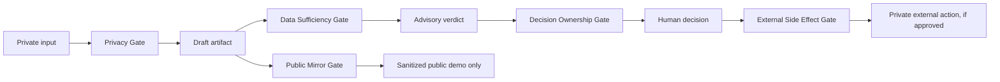
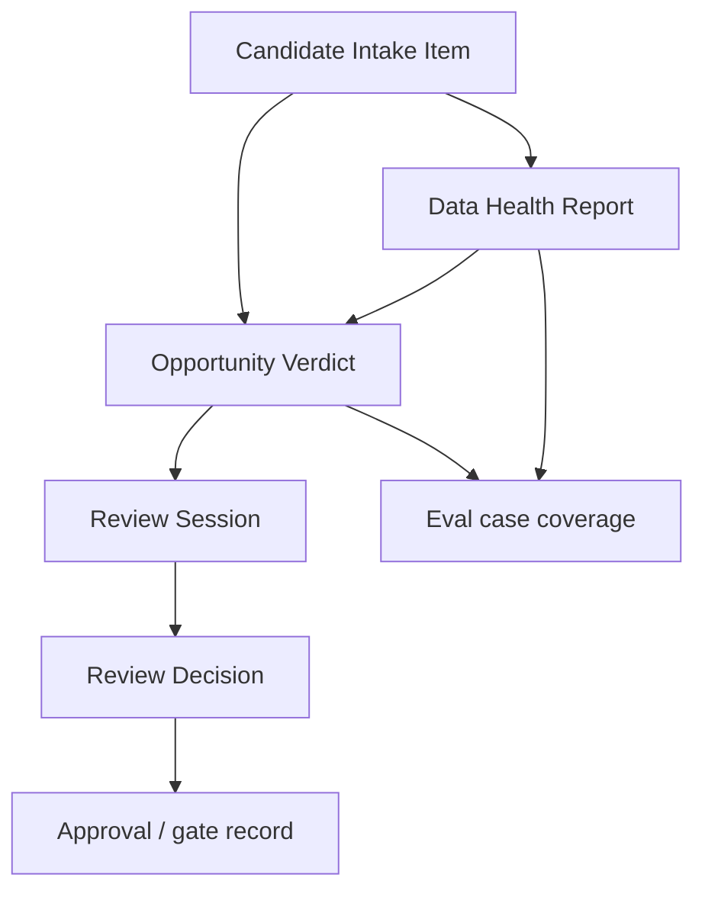

# 架构总览

## 目的

这份文档让公开镜像在不暴露私有 app 源代码或真实职业数据的前提下可审阅。
它展示 decision workflow、gate placement、observability objects，以及 public/private boundary。

架构设计刻意保持 local-first 和 human-in-the-loop。Agent 可以生成 advisory artifacts，
但职业承诺由人拥有。

## 1. 端到端 Agent Workflow



公开镜像以文档、schemas、evals 和 simulated demo outputs 的形式保留这条工作流。
它不包含运行完整 workflow 所需的私有 app code。

## 2. Gate Placement



核心 gate logic：

- Privacy Gate 防止私有职业数据离开本地范围。
- Data Sufficiency Gate 防止稀疏 snippet 变成高置信 verdict。
- Strategy Ownership Gate 防止 AI 覆盖 active strategy。
- Decision Ownership Gate 防止 AI 推进、拒绝、归档或 commit 机会。
- External Side Effect Gate 阻断投递、发消息、抓取和隐藏平台动作。
- Public Mirror Gate 只允许虚构、模拟、脱敏 artifact 进入本仓库。

## 3. 数据边界

- 私有 runtime data 留在本地 app。
- 公开镜像数据是 simulated and sanitized。
- Exported JSON 默认是私有的。
- Demo artifacts 使用虚构实体，并明确标记为 simulated。
- 真实 profile text、context、resume、JD、compensation、offer、employer、
  application history 和 tracker 都被排除。

## 4. Review Boundary

AI 可以 draft：

- profile summaries
- strategy options
- opportunity verdicts
- review sessions
- next-step suggestions

Human 必须确认：

- applying profile or context
- applying or changing strategy
- advancing, rejecting, or archiving opportunities
- creating Approved Opportunity records
- sending messages or using external channels
- applying to jobs or using any external career channel

## 5. Observability Object Map



公开镜像通过 schemas 和 demo artifacts 让这些对象可审阅：

- `schemas/opportunity_verdict.schema.json`
- `schemas/review_decision.schema.json`
- `schemas/data_health_report.schema.json`
- `demo_run/demo_candidate_intake_item.json`
- `demo_run/demo_data_health_report.json`
- `demo_run/demo_opportunity_verdict.json`
- `demo_run/demo_review_decision.json`
- `demo_run/demo_review_session.md`

## 6. Public / Private Separation

私有项目包含源代码和本地 workflow docs。公开镜像只包含 review-safe docs、schemas、evals 和
fictional demos。它有意排除 production state 和 personal career data。

```text
Private local project
  - source code
  - private app state
  - personal career data
  - real opportunity tracker
  - external channel permissions

Public mirror
  - architecture docs
  - schema contracts
  - static eval definitions
  - deterministic fictional demos
  - public safety posture
```

## 7. Validation Loop

1. Parse JSON schemas.
2. Parse demo JSON.
3. Run eval checker.
4. Scan for private paths and secrets.
5. Verify README positioning.
6. Verify demo sanitation and no external side effects.
